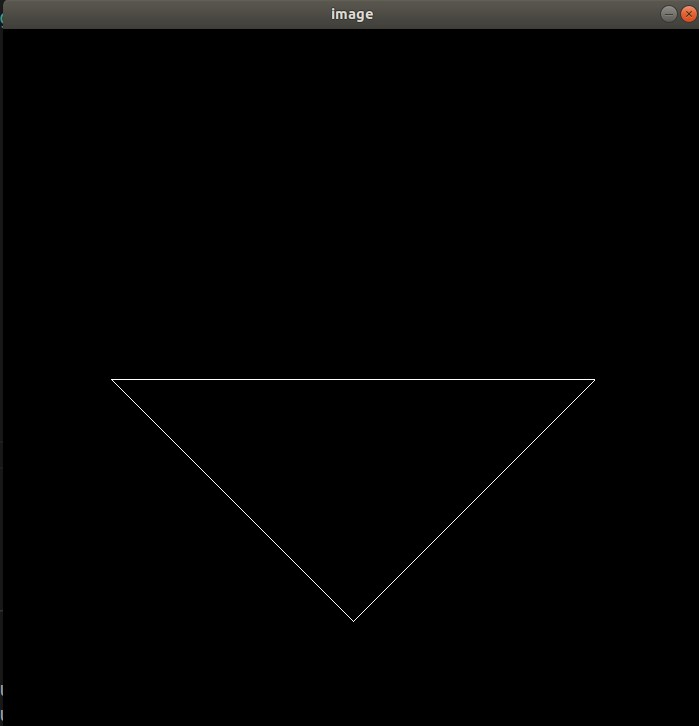

# Assignment 01

## 1. 任务

填写一个旋转矩阵和一个透视投影矩阵，进行模型、视图、投影、视口等变换来将三角形显示在屏幕上。在已有的代码框架下，只需完成模型变换和投影变换。

## 2. MVP 变换

### 2.1 Model Transformation

关于如何摆放模型。题目中只要求绕 Z 轴旋转，直接写出绕 Z 轴旋转的旋转矩阵即可。

$$
R_{z}(α) = \begin{pmatrix}
cos(α) & -sin(α) & 0 & 0 \\
sin(α) & cos(α) & 0 & 0 \\
0 & 0 & 1 & 0 \\
0 & 0 & 0 & 1 \\
\end{pmatrix}$$

绕 X、Y 轴旋转的旋转矩阵:

$$
R_{x}(α) = \begin{pmatrix}
1 & 0 & 0 & 0 \\
0 & cos(α) & -sin(α) & 0 \\
0 & sin(α) & cos(α) & 0 \\
0 & 0 & 0 & 1 \\
\end{pmatrix}$$

$$
R_{y}(α) = \begin{pmatrix}
cos(α) & 0 & sin(α) & 0 \\
0 & 1 & 0 & 0 \\
-sin(α) & 0 & cos(α) & 0 \\
0 & 0 & 0 & 1 \\
\end{pmatrix}$$

```C++
Eigen::Matrix4f get_model_matrix(float rotation_angle)
{
    Eigen::Matrix4f model = Eigen::Matrix4f::Identity(); // 单位矩阵

    // TODO: Implement this function
    // Create the model matrix for rotating the triangle around the Z axis.
    // Then return it.

    float angle = rotation_angle / 180 * MY_PI; // 角度转弧度
    Eigen::Matrix4f rotate; // 旋转矩阵
    rotate << cos(angle), -sin(angle), 0, 0, sin(angle), cos(angle), 0, 0, 0, 0,
        1, 0, 0, 0, 0, 1; // 三维中绕 z 轴旋转的变换矩阵
    model *= rotate; // 模型变换矩阵与旋转矩阵相乘

    return model;
}
```

### 2.2 View Transformation

找好角度，将相机始终固定在原点。本题中设定的相机的初始方向已经是正确的方向，所以并不需要进行旋转摆正相机，只需将相机平移到原点即可。

```cpp
Eigen::Matrix4f get_view_matrix(Eigen::Vector3f eye_pos)
{
    Eigen::Matrix4f view = Eigen::Matrix4f::Identity();

    Eigen::Matrix4f translate;
    translate << 1, 0, 0, -eye_pos[0], 0, 1, 0, -eye_pos[1], 0, 0, 1,
        -eye_pos[2], 0, 0, 0, 1; // 将相机平移至原点

    view = translate * view;

    return view;
}
```

### 2.3 Projection Transcription

将 3D 空间中的物体投影在 2D 平面上。

可以分为 Orthographic Projection（正交投影）Perspective Projection（透视投影）。正交投影的物体投影大小始终相等，透视投影会出现近大远小的现象。


```cpp
// 第一个参数为垂直方向可视角度，第二个参数为宽高比，第三个参数为近平面深度，第四个参数为远平面深度
Eigen::Matrix4f get_projection_matrix(float eye_fov, float aspect_ratio,
                                      float zNear, float zFar)
{
    // Students will implement this function

    Eigen::Matrix4f projection = Eigen::Matrix4f::Identity();

    // TODO: Implement this function
    // Create the projection matrix for the given parameters.
    // Then return it.

    float angle = eye_fov / 180 * MY_PI; // 角度转弧度
    Eigen::Matrix4f perspToOrth; // 透视投影到正交投影的变换矩阵
    perspToOrth << zNear, 0, 0, 0,
        0, zNear, 0, 0,
        0, 0, zNear + zFar, -zNear * zFar,
        0, 0, 1, 0;
    
    float t = zNear * tan(angle / 2); // 上边界
    float r = aspect_ratio * t; // 右边界
    float l = -r; // 左边界
    float b = -t; // 下边界

    Eigen::Matrix4f orthoScale; // 正交投影缩放矩阵
    orthoScale << 2 / (r - l), 0, 0, 0,
        0, 2 / (t - b), 0, 0,
        0, 0, 2 / (zNear - zFar), 0,
        0, 0, 0, 1;
    
    Eigen::Matrix4f orthoTrans; // 正交投影平移矩阵
    orthoTrans << 1, 0, 0, -(r + l) / 2,
        0, 1, 0, -(t + b) / 2,
        0, 0, 1, -(zNear + zFar) / 2,
        0, 0, 0, 1;

    Eigen::Matrix4f Mortho = orthoScale * orthoTrans; // 正交投影变换矩阵

    projection = Mortho * perspToOrth * projection;

    return projection;
}
```

由上图第三张 PPT 上的红色笔记根据 `fovY / 2` 可以算出平面的宽和高，也即是上边界和右边界；再由下半部分未画出的另一半可视角度可以计算出下边界和左边界，刚好为上、右边界的相反数。

我最初是在百度上看了其他同学的解题方法，不理解为什么下、左边界为什么直接等于上、右边界的相反数
```cpp
l = -r; 
b = -t;
```
因为我开始觉得此时只是挤压了四棱锥为长方体，坐标系还未置于物体的中心点，所以左右、上下边界可能并不对称，所以它们并不一定互为相反数。我想了挺久，最后发现挤压之后接下来做的就是正交投影了，将物体中心移到原点再缩放物体，此时物体的边界并没有改变，而且彼此间的相对位置也没有改变，所以可以提前直接认定它们就是对称的。然后我又想到了上面计算的方法也可以得出同样的结论，算是另一个佐证。

## 3. 结果

<center>
    
    &emsp;&emsp;&emsp;
    
</center>